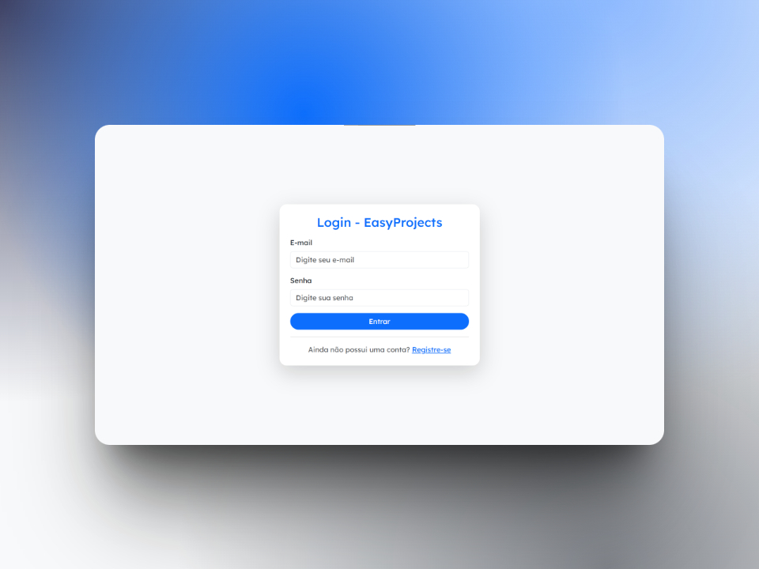
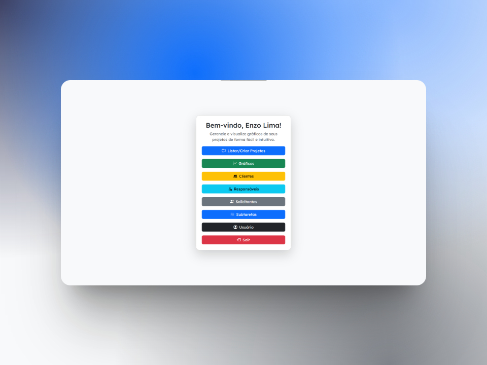
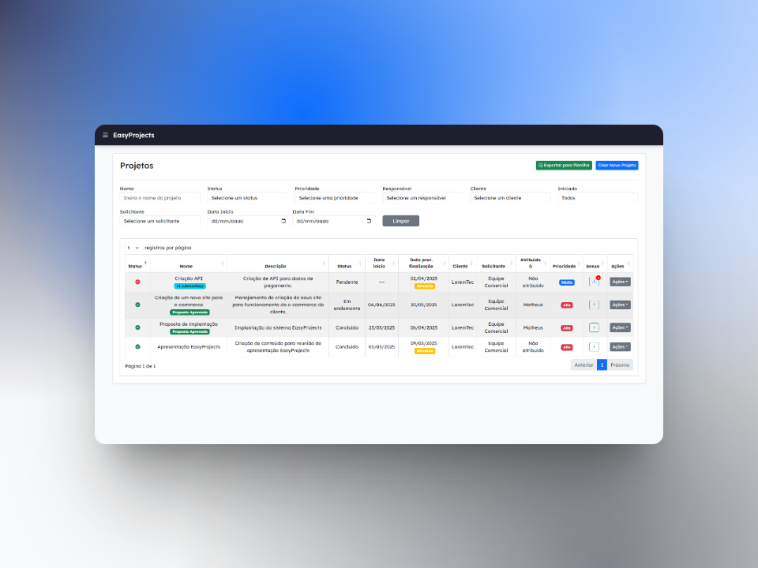
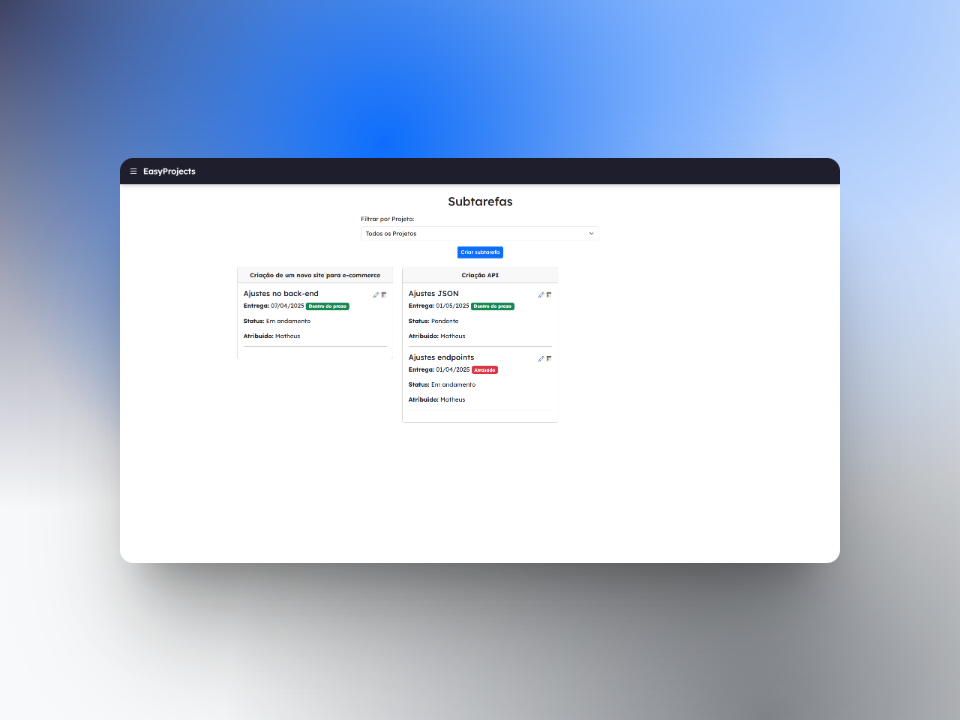
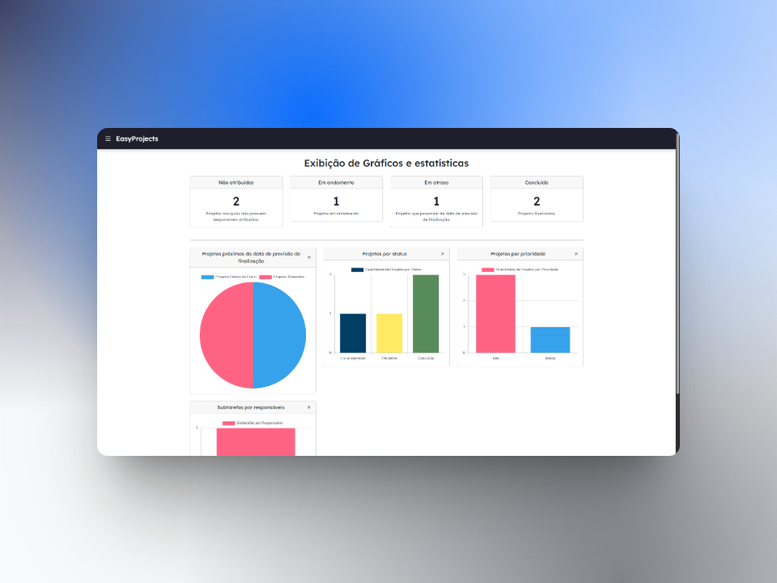

# EasyProjects 🛠️

O **EasyProjects** é uma aplicação web desenvolvida para facilitar o gerenciamento de projetos no ambiente corporativo. Com ele, você pode criar e gerenciar projetos, solicitantes, clientes, subtarefas e muito mais. Além disso, é possível visualizar gráficos e relatórios que ajudam a ter uma visão geral do andamento das atividades.
 

A ideia do projeto surgiu a partir de uma dificuldade enfrentada no dia a dia de trabalho do meu pai. Ao tentar utilizar ferramentas como Monday, ClickUp, entre outras, ele frequentemente esbarrava na complexidade de configuração de todos os parâmetros necessários para a gestão de seus projetos, além dos altos custos dessas plataformas para um controle mais avançado — o que, geralmente, não compensa para uso pessoal. Diante disso, criei o EasyProjects, que segue em constante atualização e funcionamento com base no feedback que recebo.

---

## Funcionalidades

- ✅ Cadastro e login com autenticação via **JWT Token**
- ✅ Gerenciamento de **projetos**
- ✅ Cadastro de **solicitantes**, **clientes**, **subtarefas**, etc
- ✅ Interface intuitiva com **Thymeleaf + Bootstrap**
- ✅ Visualização de **gráficos** e relatórios
- ✅ Backend robusto com **Java + Spring Boot**
- ✅ Banco de dados **PostgreSQL**

---

## Tecnologias Utilizadas

| Tecnologia       | Descrição                                      |
|------------------|------------------------------------------------|
| Java             | Linguagem principal da aplicação               |
| Spring Boot      | Framework backend (REST, JPA, JWT, etc.)       |
| PostgreSQL       | Banco de dados relacional                      |
| Thymeleaf        | Template engine para renderização de páginas  |
| HTML/CSS         | Estrutura e estilo das páginas                 |
| Bootstrap        | Framework para design responsivo               |
| JavaScript       | Comportamentos dinâmicos no frontend           |
| Docker           | Containerização e facilidade de deploy         |

---

## Screenshots

